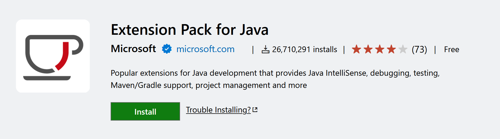

# Unimportant Dungeon Scroller

Just simple TUI "dungeon scroller" game to test my Java skillz :)

## Build from source

### Dependecies
- [VSCode](https://code.visualstudio.com/download)
    - [Extension Pack for Java](https://marketplace.visualstudio.com/items?itemName=vscjava.vscode-java-pack)

### Clone the repo

    git clone https://github.com/blckmnt/unimportant-dungeon-scroller.git

### Build it

    cd src
    javac -d ../bin/ Main.java

### Running the game
- #### In VSCode (integrated terminal)
    Go inside /src/Main.java

    Click on "Run", above the main method

- #### Run in your preffered command-line tool

        cd bin
        java Main
